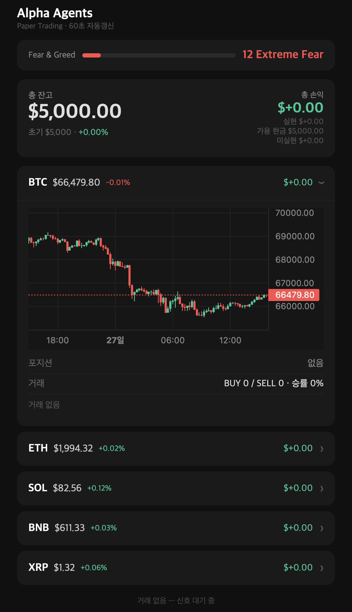

# Alpha Agents

자율 암호화폐 트레이딩 AI 시스템. LangGraph 기반 멀티 에이전트 파이프라인이 15분마다 실행되며, XGBoost 모델로 BUY/SELL/HOLD를 예측하고 포트폴리오 리스크를 관리하면서 Paper Trading을 수행한다. Railway에서 24/7 운영 중.

---

## 목차

1. [배경 및 목적](#1-배경-및-목적)
2. [시스템 아키텍처](#2-시스템-아키텍처)
3. [에이전트 상세](#3-에이전트-상세)
4. [피처 엔지니어링](#4-피처-엔지니어링)
5. [모델 설계](#5-모델-설계)
6. [자동 재학습](#6-자동-재학습)
7. [포트폴리오 리스크 관리](#7-포트폴리오-리스크-관리)
8. [데이터 수집 파이프라인](#8-데이터-수집-파이프라인)
9. [웹 대시보드](#9-웹-대시보드)
10. [한계 및 향후 계획](#10-한계-및-향후-계획)
11. [실행 방법](#11-실행-방법)
12. [디렉토리 구조](#12-디렉토리-구조)

---

## 1. 배경 및 목적

암호화폐 시장은 24시간 운영되며 변동성이 크고 다양한 신호가 복합적으로 작용한다. 사람이 직접 모니터링하며 매매 결정을 내리는 것은 비효율적이다. 이 프로젝트는 다음 질문에서 출발했다.

> "기술적 지표, 시장 심리, 검색 트렌드를 결합하면 단기 가격 방향을 예측할 수 있는가?"

단순 규칙 기반 봇이 아닌 **데이터 기반 ML 모델**을 중심에 두고, 실제 트레이딩 시스템이 갖춰야 할 요소들(리스크 관리, 포트폴리오 관리, 자동 재학습, 모니터링)을 함께 구현했다.

---

## 2. 시스템 아키텍처

### 전체 흐름

```
┌─────────────────────────────────────────────────────┐
│                   백그라운드 수집기                    │
│  OHLCV(실시간) │ Fear&Greed(24h) │ Trends(7d) │ News(1h) │
└───────────────────────┬─────────────────────────────┘
                        │ PostgreSQL
                        ▼
┌─────────────────────────────────────────────────────┐
│              15분마다 실행되는 트레이딩 사이클              │
│                                                     │
│  Analysis → Strategy → Risk → Execute               │
│  (지표계산)   (ML예측)   (검증)   (주문실행)              │
└─────────────────────────────────────────────────────┘
                        │
                        ▼
              PostgreSQL (trades 테이블)
                        │
                        ▼
              FastAPI 웹 대시보드
```

### 오케스트레이션: LangGraph StateGraph

에이전트 간 상태를 `AgentState` TypedDict로 전달하며 LangGraph가 실행 순서를 관리한다. Risk 에이전트 결과에 따라 Execute 또는 Skip으로 분기하는 조건부 라우팅을 사용한다.

```
analysis_node → strategy_node → risk_node ─┬─(approved)→ execute_node → END
                                            └─(rejected)→ skip_node   → END
```

각 심볼(BTC/ETH/SOL/BNB/XRP)에 대해 독립적으로 파이프라인이 실행되며, 60초 타임아웃으로 hang을 방지한다.

---

## 3. 에이전트 상세

### Analysis Agent (`agents/analysis_agent/`)

TA-Lib을 사용해 3개 타임프레임(15m/1h/4h)의 기술적 지표를 계산하고, DB에서 시장 심리 데이터를 조회한다.

- 15분봉 300개, 1시간봉 300개, 4시간봉 300개를 PostgreSQL에서 조회
- BTC 외 심볼은 BTCUSDT 데이터를 추가로 조회해 시장 상관관계 피처 계산
- 학습(`feature_builder.py`)과 실시간 예측(`technical.py`) 양쪽에서 **동일한 피처 값**을 생성 (학습/예측 불일치 방지)

### Strategy Agent (`agents/strategy_agent/`)

XGBoost 분류 모델이 22개 피처를 입력받아 BUY/SELL/HOLD 확률을 출력한다.

- 예측 결과: `action`, `confidence`, `proba` (각 클래스 확률)
- BTC 전용 모델(18피처)과 그 외 모델(22피처) 분리
- DB 우선 모델 로드 (파일 fallback) — Railway 재배포 후에도 최신 모델 유지

### Risk Agent (`agents/risk_agent/`)

두 가지 조건을 순차적으로 검증하고 통과 시 포지션 비중을 결정한다.

```python
1. confidence < 0.40 → 거부 (불확실한 신호)
2. MDD > 15%        → 거부 (시장 급락 시 서킷브레이커)
3. 통과 → position_ratio = max_ratio × confidence
```

포지션 비중을 confidence에 비례시킴으로써 확신이 높을수록 더 많이 투자한다.

### Execution Agent (`agents/execution_agent/`)

승인된 신호를 받아 Paper Trading을 실행한다.

- Binance API로 현재가 조회 (Testnet)
- 슬리피지 0.02%, 수수료 0.04% 시뮬레이션 적용
- 모든 거래를 PostgreSQL `trades` 테이블에 기록 (PnL, 피처값, confidence 포함)

---

## 4. 피처 엔지니어링

### 멀티 타임프레임 설계

15분봉만 사용하면 단기 노이즈에 취약하다. 4h → 1h → 15m 순으로 큰 그림에서 세부 진입 타이밍을 좁히는 방식을 채택했다.

`pd.merge_asof(direction="backward")`로 타임프레임 간 시간 정렬 — `dt.floor("4h")`를 사용하면 Binance 4h 캔들 경계와 불일치가 생겨 NaN이 대량 발생하는 문제를 이 방식으로 해결했다.

### 피처 목록

| 그룹 | 피처 | 심볼 | 선택 이유 |
|------|------|------|---------|
| 4h 지표 | RSI, MACD hist, BB position/width, EMA cross | 전체 | 중기 추세 방향 포착 |
| 1h 지표 | RSI, MACD hist, BB position, EMA cross | 전체 | 단기 추세 확인 |
| 15m 지표 | BB width, ATR, Volatility, ADX, Volume ratio, Stoch K | 전체 | 진입 타이밍, 변동성 |
| BTC 시장 | BTC 15m/1h 수익률, BTC/ETH 비율, 24h 상관관계 | BTC 제외 | 알트코인은 BTC 움직임에 종속적 |
| 시장 심리 | Fear & Greed Index | 전체 | 시장 전체 감성 |
| 검색 트렌드 | Google Trends 검색량, 전주 대비 변화율 | 전체 | 개인 투자자 관심도 선행 지표 |

**BTC 전용**: 18개 / **그 외**: 22개 (BTC 시장 피처 4개 추가)

### 레이블 생성

8시간 후(32봉 × 15m) 수익률을 기준으로 지도 학습 레이블을 생성한다.

```
future_return > +1%  → BUY  (2)
future_return < -1%  → SELL (0)
나머지               → HOLD (1)
```

±1% 임계값은 수수료·슬리피지를 커버하는 최소 수익 기준으로 설정했다.

---

## 5. 모델 설계

### 알고리즘 선택: XGBoost

- **해석 가능성**: feature importance로 어떤 지표가 예측에 기여했는지 확인 가능
- **속도**: 15분마다 실행되는 실시간 파이프라인에 적합
- **비선형 패턴**: 기술적 지표 간 복잡한 상호작용을 포착

딥러닝(LSTM 등)은 시계열에 강점이 있지만, 90일 데이터로는 과적합 위험이 높아 선택하지 않았다.

### 데이터 분할 (look-ahead bias 방지)

시계열 데이터는 `shuffle=False`를 유지하고 시간 순서대로 분할한다. 미래 데이터가 과거 학습에 유입되는 것을 방지한다.

```
전체 데이터 (시간순 정렬)
├── Train      70%  → 모델 학습
├── Validation 15%  → Early stopping 모니터링 (학습에 간접 사용)
└── Test       15%  → 최종 성능 평가 (완전 unseen — 학습에 미사용)
```

Validation을 early stopping 기준으로만 사용하고, 최종 성능은 반드시 Test 셋으로만 측정한다.

### 샘플 가중치: 두 가지 가중치의 곱

```python
combined_weight = class_balance_weight × time_decay_weight
```

**클래스 균형 가중치**: BUY/SELL이 HOLD 대비 적어 발생하는 불균형을 보정한다.

```
레이블 분포 예시 (BTCUSDT)
HOLD: 5292개 (65%)
SELL: 1831개 (22%)
BUY:  1591개 (19%)
```

**시간 감쇠 가중치**: 오래된 데이터는 낮은 가중치를 부여해 최근 시장 패턴에 더 민감하게 반응한다. 슬라이딩 윈도우처럼 데이터를 버리지 않으면서 최신성을 유지하는 방식이다.

```
weight(t) = exp(-ln(2) × days_old / halflife)
halflife = 180일 → 180일 전 데이터는 현재 데이터의 50% 가중치
```

### 현재 Test 성능 (unseen 데이터 기준)

| 심볼 | Test Accuracy | Test F1 (macro) | Test 기간 |
|------|:---:|:---:|------|
| BTCUSDT | 0.482 | 0.294 | 2026-03-14 ~ 2026-03-27 |
| ETHUSDT | 0.384 | 0.390 | 2026-03-14 ~ 2026-03-27 |
| SOLUSDT | 0.354 | 0.328 | 2026-03-14 ~ 2026-03-27 |
| BNBUSDT | 0.445 | 0.340 | 2026-03-14 ~ 2026-03-27 |
| XRPUSDT | 0.369 | 0.372 | 2026-03-14 ~ 2026-03-27 |

> **Baseline (랜덤 예측)**: Accuracy ≈ 0.33, F1 ≈ 0.33
>
> 현재 데이터가 90일치(~8000개 샘플)밖에 없어 test 기간이 2주로 짧다. 데이터가 누적될수록 평가 신뢰도가 높아진다. 주간 자동 재학습으로 성능이 점진적으로 개선될 것으로 기대한다.

---

## 6. 자동 재학습

### 설계 원칙

- **전체 누적 데이터 사용**: 슬라이딩 윈도우로 데이터를 버리지 않고 시간 감쇠 가중치로 최신성을 확보
- **성능 회귀 방지**: 새 모델 F1이 기존 대비 1% 이상 하락하면 교체하지 않음
- **무중단 적용**: 재시작 없이 메모리 내 모델을 즉시 핫스왑
- **배포 독립**: 모델을 PostgreSQL BYTEA로 저장 — Railway 재배포 후에도 유지

```
매주 일요일 00:00 UTC
        │
        ▼
전체 데이터로 재학습 (시간 감쇠 가중치 적용)
        │
        ▼
Test F1 비교: 새 모델 ≥ 기존 - 1%?
   YES → DB 저장 + 메모리 핫스왑
   NO  → 기존 모델 유지
```

---

## 7. 포트폴리오 리스크 관리

### 단일 자본 풀

심볼별 독립 자본($1000 × 5 = $5000 분리)이 아닌 하나의 포트폴리오 풀로 관리한다.

```
[잘못된 방식] BTC $1000 | ETH $1000 | SOL $1000 | ...  (각각 격리)
[현재 방식]  포트폴리오 $5000 → 신호에 따라 동적 배분
```

- BUY 시: 가용 현금의 `position_ratio`만큼 투자
- SELL 시: 매도 대금이 공유 풀로 반환
- `position_ratio = max_ratio(0.25) × confidence` — 확신이 높을수록 더 많이 투자

### 서킷브레이커

30일 고점 대비 낙폭(MDD) 이 15%를 초과하면 해당 심볼의 신규 진입을 중단한다. 급락장에서의 과도한 손실을 방지한다.

---

## 8. 데이터 수집 파이프라인

모든 수집기는 `main.py`에서 `asyncio.create_task()`로 백그라운드 실행된다.

| 수집기 | 주기 | 저장 테이블 | 비고 |
|--------|------|------------|------|
| OHLCV | 실시간 | `ohlcv` | Binance 15m/1h/4h |
| Fear & Greed | 24시간 | `onchain` | alternative.me, 키 불필요 |
| Google Trends | 7일 | `onchain` | pytrends, 키 불필요, 5년치 백필 가능 |
| CryptoPanic | 1시간 | `news_sentiment` | 무료 키 필요, 향후 학습 피처용 |

### 뉴스 감성 데이터 전략

CryptoPanic은 현재 데이터를 **쌓기만** 하고 있다. 과거 데이터 API가 유료이므로, 충분한 기간(3~6개월)이 쌓인 후 `news_sentiment` 테이블을 피처로 추가해 재학습할 계획이다.

---

## 9. 웹 대시보드



Railway에 배포된 FastAPI 서버에서 제공한다. 모바일에서도 확인 가능하도록 max-width 480px 기준으로 설계했다.

- **포트폴리오 요약**: 총 잔고, 초기 대비 수익률, 가용 현금, 실현/미실현 손익
- **Fear & Greed 게이지**: 실시간 시장 심리 시각화
- **심볼 카드 (아코디언)**: 기본은 한 줄 요약 (심볼명/현재가/변화율/손익), 클릭하면 캔들차트 + 포지션 + 최근 거래 내역 펼쳐짐
- **차트 Lazy Load**: 열 때만 API 호출해서 초기 로딩 속도 최적화
- **60초 자동 갱신**

---

## 10. 한계 및 향후 계획

### 현재 한계

| 항목 | 내용 |
|------|------|
| 데이터 부족 | 90일치 데이터로 학습 — test 기간이 2주로 짧아 성능 평가 신뢰도 낮음 |
| 이벤트 맹점 | 뉴스·규제·해킹 등 돌발 이벤트를 가격 패턴만으로 포착 불가 |
| 단방향 포지션 | 롱 포지션만 지원 (숏 없음) |
| Paper Trading | 실제 시장 충격(슬리피지, 유동성)을 완전히 반영하지 못함 |

### 향후 계획

- **CryptoPanic 피처 추가**: 3~6개월 뉴스 감성 데이터 축적 후 학습 피처로 편입
- **데이터 확장**: 90일 → 1년+ 으로 학습 데이터 확대
- **Telegram 알림**: BUY/SELL 신호 발생 시 실시간 알림
- **Live Trading**: Paper Trading 검증 후 실제 소액 실거래 전환

---

## 11. 실행 방법

### 로컬

```bash
# 의존성 설치
pip install -r requirements.txt

# 인프라 실행 (PostgreSQL)
docker-compose up -d

# 환경변수 설정
cp .env.example .env
# .env에 Binance API 키 등 입력

# OHLCV 백필 (90일)
PYTHONPATH=. python3 scripts/backfill_ohlcv.py --days 90

# Google Trends 백필 (5년치 주간 데이터)
PYTHONPATH=. python3 scripts/backfill_trends.py

# XGBoost 학습 (Train 70% / Val 15% / Test 15%)
PYTHONPATH=. python3 agents/strategy_agent/trainer.py

# 모델 DB 업로드 (Railway 배포 시 필요)
PYTHONPATH=. python3 scripts/upload_models_to_db.py

# 실행 (트레이딩 봇 + 웹 서버 동시 실행)
PYTHONPATH=. python3 start.py
```

### Railway 배포

1. Railway에서 Empty Project 생성
2. PostgreSQL 서비스 추가
3. GitHub Repo 연결
4. alpha-agents 서비스 Variables 설정:

```
DATABASE_URL=${{Postgres.DATABASE_URL}}
BINANCE_API_KEY=...
BINANCE_API_SECRET=...
BINANCE_TESTNET=true
TRADING_SYMBOLS=BTCUSDT,ETHUSDT,SOLUSDT,BNBUSDT,XRPUSDT
TOTAL_CAPITAL=5000
MAX_POSITION_RATIO=0.25
MDD_CIRCUIT_BREAKER=0.15
CRYPTOPANIC_API_KEY=...   # 선택
```

5. 배포 후 초기 데이터 세팅 (로컬에서 Railway DB URL로 실행):

```bash
DATABASE_URL=<Railway DB URL> PYTHONPATH=. python3 scripts/backfill_ohlcv.py --days 90
DATABASE_URL=<Railway DB URL> PYTHONPATH=. python3 scripts/backfill_trends.py
DATABASE_URL=<Railway DB URL> PYTHONPATH=. python3 scripts/upload_models_to_db.py
```

---

## 12. 디렉토리 구조

```
alpha-agents/
├── agents/
│   ├── analysis_agent/
│   │   └── technical.py          # 기술적 지표 계산 + 시장 심리 조회
│   ├── strategy_agent/
│   │   ├── feature_builder.py    # 학습용 피처 생성 (멀티 타임프레임 병합)
│   │   ├── labeler.py            # BUY/SELL/HOLD 레이블 생성
│   │   ├── trainer.py            # XGBoost 학습 (3-way split, 가중치)
│   │   ├── xgb_model.py          # 모델 로드·예측 (DB 우선, 파일 fallback)
│   │   └── weekly_retrain.py     # 주간 자동 재학습 스케줄러
│   ├── risk_agent/
│   │   └── risk.py               # confidence 체크, MDD 서킷브레이커
│   ├── execution_agent/
│   │   └── paper_trader.py       # Paper trading (포트폴리오 풀 방식)
│   └── data_agent/collectors/
│       ├── ohlcv.py              # Binance OHLCV 실시간 수집
│       ├── fear_greed.py         # Fear & Greed Index 수집
│       ├── trends.py             # Google Trends 주간 갱신
│       └── cryptopanic.py        # 뉴스 감성 수집 (향후 피처용)
├── graph/
│   ├── state.py                  # AgentState TypedDict
│   └── graph.py                  # LangGraph StateGraph 정의
├── storage/
│   └── postgres_manager.py       # DB 연결·테이블 초기화
├── backtest/
│   └── engine.py                 # 백테스트 엔진
├── web/
│   └── app.py                    # FastAPI 대시보드
├── scripts/
│   ├── backfill_ohlcv.py         # OHLCV 히스토리컬 백필
│   ├── backfill_trends.py        # Google Trends 5년치 백필
│   └── upload_models_to_db.py    # 모델 파일 → DB 업로드
├── models/                       # XGBoost pkl 파일 (파일 fallback용)
├── config/settings.py            # 환경변수 기반 설정
├── start.py                      # 봇 + 웹서버 동시 실행
└── main.py                       # 트레이딩 메인 루프
```

---

## 기술 스택

| 분류 | 기술 |
|------|------|
| 오케스트레이션 | LangGraph StateGraph |
| ML 모델 | XGBoost |
| 기술적 지표 | TA-Lib |
| 비동기 처리 | asyncio, asyncpg |
| DB | PostgreSQL |
| 웹 프레임워크 | FastAPI |
| 차트 | TradingView Lightweight Charts |
| 배포 | Railway |
| 외부 API | Binance, alternative.me, pytrends, CryptoPanic |
